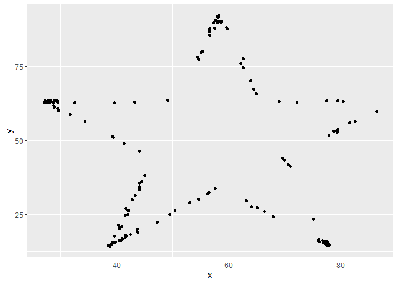
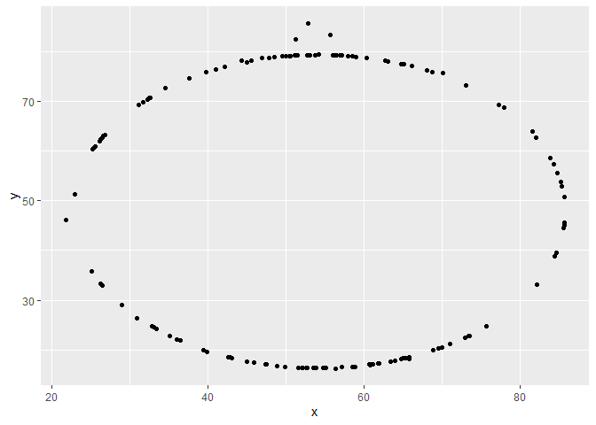
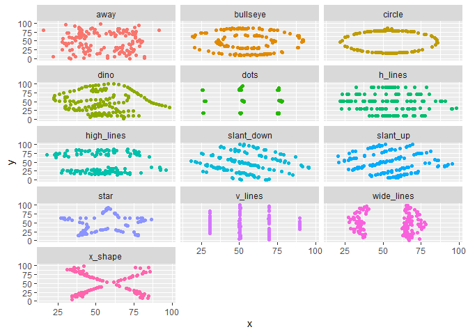

Lab 01 - Hello R
================
Fanyi Zeng
01/14/22

## Load packages and data

``` r
library(tidyverse) 
library(datasauRus)
```

## Exercises

### Exercise 1

A data frame with 1846 rows and 3 variables:

dataset: indicates which dataset the data are from

x: x-values

y: y-values

### Exercise 2

First let’s plot the data in the dino dataset:

``` r
dino_data <- datasaurus_dozen %>%
  filter(dataset == "dino")

ggplot(data = dino_data, mapping = aes(x = x, y = y)) +
  geom_point()
```

<!-- -->

And next calculate the correlation between `x` and `y` in this dataset:

``` r
dino_data %>%
  summarize(r = cor(x, y))
```

    ## # A tibble: 1 x 1
    ##         r
    ##     <dbl>
    ## 1 -0.0645

### Exercise 3

First let’s plot the data in the star dataset!

``` r
star_data <- datasaurus_dozen %>%
  filter(dataset == "star")
ggplot(data = star_data, mapping = aes (x=x, y=y))+
  geom_point()
```

<!-- -->

Next let’s calculate the correlation between x and y in this dataset!

``` r
star_data %>%
  summarize(r=cor(x,y))
```

    ## # A tibble: 1 x 1
    ##         r
    ##     <dbl>
    ## 1 -0.0630

### Exercise 4

Plot the data in the circle dataset.

``` r
circle_data <- datasaurus_dozen %>%
  filter (dataset == "circle")
ggplot(data = circle_data, mapping = aes (x=x, y=y))+
  geom_point()
```

<!-- -->

Calculate the correlation between x and y in the circle dataset.

``` r
circle_data %>%
  summarize(r=cor(x,y))
```

    ## # A tibble: 1 x 1
    ##         r
    ##     <dbl>
    ## 1 -0.0683

### Exercise 5

Finally, let’s plot all datasets at once. In order to do this we will
make use of faceting. Facet by the dataset variable, placing the plots
in a 3 column grid.

``` r
ggplot(datasaurus_dozen, aes(x = x, y = y, color = dataset))+
  geom_point()+
  facet_wrap(~ dataset, ncol = 3) +
  theme(legend.position = "none")
```

<!-- -->

And we can use the group_by function to generate all the summary
correlation coefficients.

``` r
datasaurus_dozen %>%
  group_by(dataset) %>%
  summarize(r = cor(x, y)) %>%
  print(13)
```

    ## # A tibble:
    ## #   13 x 2
    ##    dataset   
    ##    <chr>     
    ##  1 away      
    ##  2 bullseye  
    ##  3 circle    
    ##  4 dino      
    ##  5 dots      
    ##  6 h_lines   
    ##  7 high_lines
    ##  8 slant_down
    ##  9 slant_up  
    ## 10 star      
    ## 11 v_lines   
    ## 12 wide_lines
    ## 13 x_shape   
    ## # ... with 1
    ## #   more
    ## #   variable:
    ## #   r <dbl>

## Bonus Tips by Yoo Ri

Here are some helpful tips :)

-   filter() is for extracting rows

-   group_by() is for grouping datasets by assigned column

-   ungroup() cancels the grouping

-   summarize() is often used with group_by(). This function can print
    the output according to the group_by().

-   facet_grid(y\~x,…) creates a grid with variable y as a row, variable
    x as a column  

-   facet_wrap(x,… ) is useful when there is only one variable
